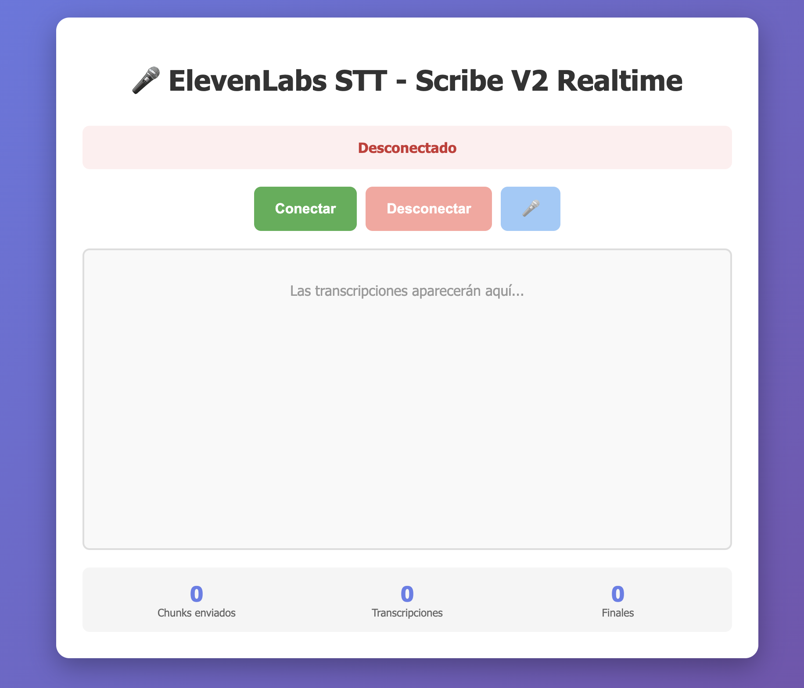

# ElevenLabs Scribe V2 Realtime STT

Proyecto de ejemplo para transcripción en tiempo real usando el modelo Scribe V2 de ElevenLabs.
Permite enviar audio vía WebSocket desde un cliente (HTML) y recibir transcripciones parciales/finales en tiempo real.

## Captura de pantalla



**Estado:** Inicial — instrucciones de uso y desarrollo.

## Contenido

- `server/` - Backend en FastAPI que expone un WebSocket para ingestión de audio y emisión de transcripciones.
- `client/` - Cliente HTML de ejemplo (`elevenlabs_stt_realtime.html`) para enviar audio al servidor.
- `.env.example` - Ejemplo de variables de entorno necesarias.

## Requisitos

- Python >= 3.13
- [uv](https://docs.astral.sh/uv/) - Gestor de paquetes y entornos Python ultrarrápido
- Una API key válida de ElevenLabs (véase `.env.example`)

## Instalación rápida

### 1. Instalar uv (si no lo tienes)

En macOS/Linux:

```bash
curl -LsSf https://astral.sh/uv/install.sh | sh
```

O con Homebrew:

```bash
brew install uv
```

### 2. Sincronizar dependencias

Desde la raíz del repositorio:

```bash
uv sync
```

Este comando creará automáticamente un entorno virtual en `.venv` e instalará todas las dependencias definidas en `pyproject.toml`.

### 3. Configurar variables de entorno

```bash
cp .env.example .env
# Edita .env y añade tu ELEVENLABS_API_KEY
```

## Ejecutar el servidor

Usando `uv run` (recomendado):

```bash
uv run uvicorn server.app:app --host 0.0.0.0 --port 5050 --reload
```

O activando el entorno virtual manualmente:

```bash
source .venv/bin/activate
uvicorn server.app:app --host 0.0.0.0 --port 5050 --reload
```

También puedes ejecutar directamente el módulo:

```bash
uv run python -m server.app
```

### Endpoints disponibles

El servidor expone:

- `GET /healthcheck` — devuelve `{"status": 200}` cuando está OK
- WebSocket: `ws://<HOST>:5050/v1/elevenlabs/ws/elevenlabs-voice`

El flujo implementado en `server/routers/speech_to_text.py` crea tres tareas asíncronas concurrentes:
1. Recepción de audio desde el cliente
2. Procesamiento/streaming hacia ElevenLabs Scribe V2
3. Envío de transcripciones al cliente

## Cliente de ejemplo

El archivo `client/elevenlabs_stt_realtime.html` contiene un ejemplo simple que captura audio del micrófono y lo envía por WebSocket al servidor.

Para probarlo localmente, sirve la carpeta `client/` con un servidor HTTP:

```bash
# Desde la raíz del repo
uv run python -m http.server 8000 --directory client
# Luego abre http://localhost:8000/elevenlabs_stt_realtime.html
```
Pasos en el frontal:
- Dale a conectar 
- Despues dale al simbolo del microfono y dale permisos
- Comienza a hablar y verás las transcripciones

**Nota:** El navegador debe permitir el acceso al micrófono y el servidor debe estar corriendo (CORS permitido por defecto en el backend).

## Variables de entorno

Usar `.env` (no subir al repositorio). Variables principales:

- `ELEVENLABS_API_KEY` — tu API key para ElevenLabs

## Desarrollo

Estructura del código:

- `server/services/elevenlabs.py` - Servicio STT principal
- `server/routers/speech_to_text.py` - Router y lógica de WebSocket
- `server/app.py` - Aplicación FastAPI principal

### Comandos útiles con uv

```bash
# Añadir una nueva dependencia
uv add nombre-paquete

# Actualizar dependencias
uv sync --upgrade

# Ejecutar scripts con el entorno virtual
uv run python script.py

# Ver dependencias instaladas
uv pip list
```

Recomendaciones:
- Usa `--reload` en uvicorn durante desarrollo para recarga automática
- Revisa los logs para diagnósticos (el servidor configura logging básico)

## Contribuir

Pull requests bienvenidos. Abre issues para bugs o mejoras. Mantén los cambios pequeños y documentados.

## Licencia

Añade aquí la licencia del proyecto si procede (por ejemplo MIT).

## Contacto / Recursos

- [Documentación de ElevenLabs API](https://api.elevenlabs.io)
- [Documentación de uv](https://docs.astral.sh/uv/)
- Para dudas sobre este repo abre un issue en GitHub

